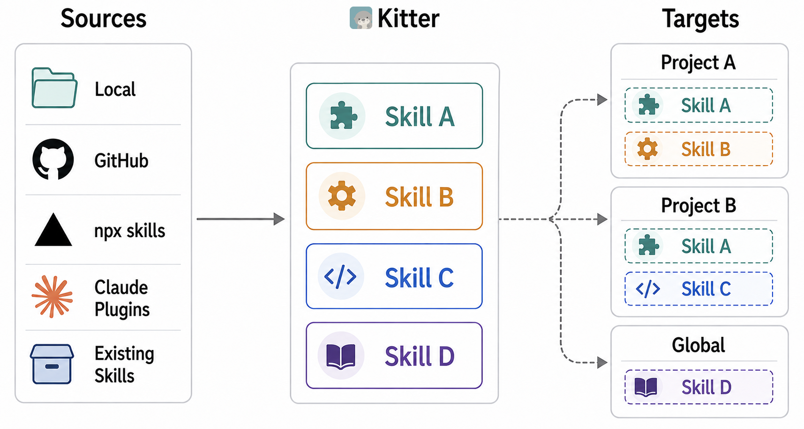

<p align="center">
  
</p>

<p align="center">
  <a href="./README.md">English</a>
</p>

<p align="center">
  <a href="./LICENSE"></a>
  
  
</p>

<p align="center"><strong>一套 Skill 仓库，让每个项目只获得自己需要的 Skill。</strong></p>

Kitter 是一个管理 Agent Skill 的桌面应用和 CLI。将 Skill 集中在一套仓库中，为每个项目选择合适的组合，在一处统一更新。

Kitter 完全使用 Rust 和 GPUI 构建，界面简洁直观，体积小、资源占用低，操作流畅。

<p align="center">
  
</p>

## 为什么选择 Kitter

同时维护多个项目时，同一个 Skill 往往会有多份副本，各个 Agent 实际能用哪些 Skill 也不容易掌握。Kitter 帮你理清这些关系：

- **统一维护**——各个项目链接到同一份 Skill 来源，更新一次即可应用到所有关联安装。
- **按项目选用**——每个项目拥有自己的 Skill 组合，通用的 Skill 也可以安装到用户级目录。
- **查看实际生效内容**——了解每个 Agent 能发现的 Skill、来源及预计上下文开销，也能看到 Kitter 之外的安装。

## 安装 Kitter

从 [GitHub Releases](https://github.com/what1f/kitter/releases/latest) 下载适合你系统的桌面应用。

- **macOS（Apple Silicon）**——打开 `.dmg`，将 `Kitter.app` 拖入 `Applications`。
- **Windows（x64）**——下载 `Kitter-<version>-desktop-windows-x86_64.exe`，直接运行。
- **Linux（x64）**——解压 `Kitter-<version>-desktop-linux-x86_64.tar.gz`，进入解压后的 `Kitter` 目录，运行 `./Kitter`。

Kitter 暂时没有 Apple Developer ID 签名。如果首次启动被 macOS 阻止，请确认应用来自官方 Release，再前往 **系统设置 → 隐私与安全 → 仍要打开**，按提示确认。详见 [Apple 官方指引](https://support.apple.com/zh-cn/102445)。

也可以执行以下命令，然后重新打开 Kitter：

```bash
xattr -dr com.apple.quarantine /Applications/Kitter.app
```

桌面应用和 CLI 共用同一套核心，但作为两个独立产物发布。GitHub Release 提供 macOS、Windows 和 Linux 的独立 CLI 包；内置 Kitter Skill 会查找这个独立 CLI，并在缺失时引导你下载。

## 使用 Kitter 管理 Skill

### 1. 建立一套 Skill 仓库

点击 **+**，可以从本地目录、GitHub、兼容 skills.sh 的来源或 Claude 插件来源添加 Skill。如果 Skill 已经散落在多个项目中，可以选择 **已有安装**，在不搬动源目录的前提下检查并纳管它们。

Kitter 为每个 Skill 保留一份长期维护的来源。打开它的 **安装情况**，就能立即看到哪些项目正在使用它、每个安装位置，以及哪些 Agent 可以发现它。

<p align="center">
  
</p>

### 2. 只安装到需要的项目

选中一个 Skill 和目标项目，再选择共享的 `.agents/skills` 目录或指定 Agent 的目录。Kitter 建立托管链接，而不是复制出互不相关的副本，因此每个项目都可以拥有自己的 Skill 组合，同时保持来源一致。

<p align="center">
  
</p>

各个项目都会用到的 Skill，也可以安装到用户级全局目录。

### 3. 验证实际生效内容

打开 **项目**，可以看到每个 Agent 完整的生效 Skill 集合，而不只是 Kitter 托管的安装。Kitter 会发现项目级、上级目录、用户级、内置及插件提供的能力，并标明每一项来自哪里。

每个 Agent 的 token 估算可以帮助你发现不必要的 Skill 上下文开销。

<p align="center">
  
</p>

### 4. 只更新一次

在桌面应用中执行 **检查更新**，或使用 `kitter check` 和 `kitter update`。所有托管项目会继续使用同一份维护来源。

对应的 CLI 工作流很简洁：

```bash
kitter add npx https://github.com/owner/repository --skill skill-a
kitter install skill-a --project /path/to/project --target universal
kitter project /path/to/project
kitter update skill-a
```

## 独立 CLI 与 Agent Skill

使用 Kitter 不要求安装桌面应用。你可以从 [GitHub Releases](https://github.com/what1f/kitter/releases/latest) 下载独立 CLI，将 `kitter` 放入 `PATH`，然后直接安装 [`$kitter` Skill](./resources/skills/kitter)：

```bash
npx skills add what1f/kitter --skill kitter
```

这个 Skill 让 Agent 可以通过独立的 `kitter` CLI 盘点当前机器、添加或纳管 Skill 来源、为项目安装正确组合并验证结果。缺少 CLI 时，它会引导你从官方 Release 下载。

<details>
<summary><strong>从源码构建</strong></summary>

```bash
git clone https://github.com/what1f/kitter.git
cd kitter
cargo run --release --locked --features desktop --bin kitter-desktop
```

</details>

## 平台状态

- **macOS（Apple Silicon）**——提供桌面应用和独立 CLI。
- **Windows（x64）**——提供桌面应用和独立 CLI，已在 Windows 上测试，并针对启动和性能问题完成适配修复。
- **Linux（x64）**——提供独立 CLI 和桌面构建，桌面应用仍需在真实系统中验证。

## 本地数据

Kitter 将配置和来源记录保存在操作系统的应用数据目录，Skill 内容保存在仓库目录：

| 平台 | 默认 Skill 仓库 |
| --- | --- |
| macOS | `~/Library/Application Support/Kitter/skills` |
| Windows | `%LOCALAPPDATA%\Kitter\skills` |
| Linux | `$XDG_DATA_HOME/Kitter/skills` 或 `~/.local/share/Kitter/skills` |

使用 `kitter library` 和 `kitter library --set /absolute/path` 查看或修改位置。

## 参与贡献

欢迎提交 Issue 和 Pull Request。如果准备进行较大的行为或 UI 改动，请先创建 [Issue](https://github.com/what1f/kitter/issues) 对齐范围。

如果 Kitter 让你的 Skill 管理变得更从容，欢迎为[项目点一颗 Star](https://github.com/what1f/kitter)，让更多同时维护多个项目的开发者看到它。

## 许可证

Kitter 使用 [Apache License 2.0](./LICENSE) 开源。内置字体、图标及其他第三方素材的许可证见 [THIRD_PARTY_LICENSES.md](./THIRD_PARTY_LICENSES.md)。
